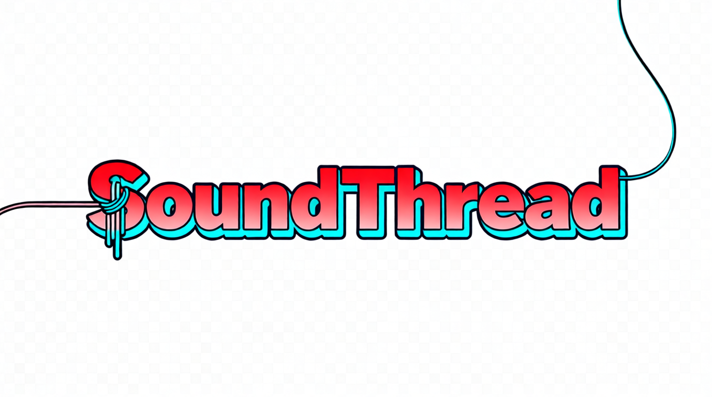

<h1 align="center">🪐 Awesome Audio Watermarking</h1>

<b>
🚀 SOUNDTHREAD：An UP-TO-DATE curated list of research and techniques for <strong>audio watermarking</strong>.
</b>

  
  
  
  

## 📑 Navigation

| [🌈 Post-Processing](#-post-processing) | 💡[Generative](#-generative) | 📂[Benchmark & Surveys](#-benchmark&surveys) | 📚 [Related Repos](#-related-repos)

- Audio watermarking has been categoried into **Post-processing** and **Generative**. Post-processing means the watermark is embedded in the audio after it is generated/recorded, while Generative means the watermark is embedded during the generation process.
- PRs are welcome!

## 🌁 Post-Processing

- **(AudioSeal) Proactive Detection of Voice Cloning with Localized Watermarking**
    - ICML 2024
    - Robin San Roman, Pierre Fernandez, Alexandre Défossez, Teddy Furon, Tuan Tran, Hady Elsahar
    - University of Chicago
    - [Paper](https://arxiv.org/abs/2401.17264) [Code](https://github.com/facebookresearch/audioseal)

- **(Wavmark) WavMark: Watermarking for Audio Generation**
    - Arixv 2023
    - Guangyu Chen, Yu Wu, Shujie Liu, Tao Liu, Xiaoyong Du, Furu Wei
    - Renmin University of China
    - [Paper](https://arxiv.org/abs/2308.12770) [Code](https://github.com/wavmark/wavmark)

- **(Timbre) Detecting Voice Cloning Attacks via Timbre Watermarking**
    - NDSS 2024
    - Chang Liu, Jie Zhang*, Tianwei Zhang, Xi Yang, Weiming Zhang*, Nenghai Yu
    - University of Science and Technology of China
    - [Paper](https://www.ndss-symposium.org/wp-content/uploads/2024-200-paper.pdf) [Code](https://github.com/TimbreWatermarking/TimbreWatermarking)
    - Note: watermark entangled with timbre features

- **DeAR: A Deep-Learning-Based Audio Re-recording Resilient Watermarking**
    - AAAI 2023
    - Chang Liu, Jie Zhang, Han Fang, Zehua Ma, Weiming Zhang*, Nenghai Yu
    - University of Science and Technology of China
    - [Paper](https://arxiv.org/pdf/2212.02339) 

- **WMCodec: End-to-End Neural Speech Codec with Deep Watermarking for Authenticity Verification**
    - ICASSP 2025
    - Junzuo Zhou, Jiangyan Yi*, Yong Ren, Jianhua Tao, Tao Wang, Chu Yuan Zhang
    - Institute of Automation, Chinese Academy of Sciences
    - [paper](https://arxiv.org/abs/2409.12121) [code](https://github.com/zjzser/WMCodec)

- **Speech Watermarking with Discrete Intermediate Representations**
    - AAAI 2025
    - Shengpeng Ji, Ziyue Jiang, Jialong Zuo, Minghui Fang, Yifu Chen, Tao Jin, Zhou Zhao*
    - Zhejiang University
    - [Paper](https://arxiv.org/abs/2412.13917)

- **AudioMarkNet: Audio Watermarking for Deepfake Speech Detection**
    - Usenix Security 2025
    - Wei Zong*, Yang-Wai Chow, Willy Susilo, and Joonsang Baek
    - University of Wollongong
    - [Paper](https://www.usenix.org/system/files/usenixsecurity25-zong.pdf) [Code](https://zenodo.org/records/14722182)

- **AUDIO WATERMARK: Dynamic and Harmless Watermark for Black-box Voice Dataset Copyright Protection**
    - Usenix Security 2025
    - Hanqing Guo 
    - University of Hawaii at Manoa
    - [Paper](https://www.usenix.org/system/files/conference/usenixsecurity25/sec25cycle1-prepub-1193-guo-hanqing.pdf) [Code](https://github.com/audiowatermark/audiowatermark.github.io)
    - Note: first voice dataset watermarking work

- **VoiceMark: Zero-Shot Voice Cloning-Resistant Watermarking Approach Leveraging Speaker-Specific Latents**
    - InterSpeech 2025
    - Haiyun Li, Zhiyong Wu, Xiaofeng Xie, Jingran Xie, Yaoxun Xu, Hanyang Peng
    - Tsinghua University

- **Maskmark: Robust Neuralwatermarking for Real and Synthetic Speech**
    - ICASSP 2024
    - Patrick O'Reilly, Zeyu Jin, Jiaqi Su, Bryan Pardo*
    - Northwestern University
    - [Paper](https://arxiv.org/pdf/2504.10782)

- **XAttnMark: Learning Robust Audio Watermarking with Cross-Attention**
    - ICML 2025
    - Yixin Liu, Lie Lu, Jihui Jin, Lichao Sun, Andrea Fanelli*
    - Dolby Lab
    - [Paper](https://openreview.net/pdf?id=zuOKPHHfEr) [Page](https://liuyixin-louis.github.io/xattnmark/)

 

## 💡 Generative

### 1. Manipulating Input/Output of audio generation
- **WMCodec: End-to-End Neural Speech Codec with Deep Watermarking for Authenticity Verification**
    - ICASSP 2025
    - Junzuo Zhou, Jiangyan Yi*, Yong Ren, Jianhua Tao, Tao Wang, Chu Yuan Zhang
    - Institute of Automation, Chinese Academy of Sciences
    - [paper](https://arxiv.org/abs/2409.12121) [code](https://github.com/zjzser/WMCodec)

- **GROOT: Generating Robust Watermark for Diffusion-Model-Based Audio Synthesis**
    - ACM MM 2024
    - Weizhi Liu, Yue Li, Dongdong Lin, Hui Tian, Haizhou Li
    - [Paper](https://arxiv.org/abs/2407.10471)

- **TraceableSpeech: Towards Proactively Traceable Text-to-Speech with Watermarking**
    - InterSpeech 2024
    - Junzuo Zhou, Jiangyan Yi*, Tao Wang, Jianhua Tao, Ye Bai, Chu Yuan Zhang, Yong Ren, Zhengqi Wen
    - [Paper](https://arxiv.org/pdf/2406.04840)

### 2. Training/fine-tuning the generative model
- **(CollabMark) Collaborative Watermarking for Adversarial Speech Synthesis**
    - ICASSP 2025
    - Lauri Juvela, Xin Wang
    - Aalto University
    - [Paper](https://arxiv.org/abs/2405.08720)

- **Audio Codec Augmentation for Robust Collaborative Watermarking of Speech Synthesis**
    - ICASSP 2025
    - Lauri Juvela, Xin Wang
    - Aalto University
    - [Paper](https://arxiv.org/abs/2409.13382)
    - Note: Follow-up work of CollabMark

- **TriniMark: A Robust Generative Speech Watermarking Method for Trinity-Level Attribution**
    - arXiv 2025
    - Yue Li, Weizhi Liu, Dongdong Lin
    - National Huaqiao University
    - [Paper](https://arxiv.org/abs/2503.03001)

- **Latent Watermarking of Audio Generative Models**
    - ICASSP 2025
    - Robin San Roman, Pierre Fernandez, Antoine Deleforge, Yossi Adi, Romain Serizel
    - Meta, FAIR
    - [Paper](https://arxiv.org/abs/2409.02915)

- **Poisoning The Diffusion: A Simple and Robust Watermarking Method for Audio Generation**
    - ICASSP 2025
    - Yi Tang
    - South China University of Technology
    - [Paper](https://ieeexplore.ieee.org/document/10889187)

- **P2Mark: Plug-and-play Parameter-level Watermarking for Neural Speech Generation**
    - Arxiv 2025
    - Yong Ren, Jiangyan Yi*, Tao Wang, Jianhua Tao, Zheng Lian, Zhengqi Wen, Chenxing Li, Ruibo Fu, Ye Bai, Xiaohui Zhang
    - Institute of Automation, Chinese Academy of Sciences
    - [Paper](https://arxiv.org/abs/2504.05197)

 

## 📂 Benchmark & Surveys
- **AudioMarkBench: Benchmarking Robustness of Audio Watermarking**
    - Neurips 2024
    - Hongbin Liu, Moyang Guo, Zhengyuan Jiang, Lun Wang, Neil Zhenqiang Gong
    - Duke University
    - [Paper](https://arxiv.org/abs/2406.06979) [Code](https://github.com/mileskuo42/AudioMarkBench)

- **Deep Audio Watermarks are Shallow: Limitations of Post-Hoc Watermarking Techniques for Speech**
    - ICLR workshop 2024
    - Patrick O'Reilly, Zeyu Jin, Jiaqi Su, Bryan Pardo*
    - Northwestern University
    - [Paper](https://arxiv.org/abs/2504.10782) 

- **DeepMark Benchmark: Redefining Audio Watermarking Robustness**
    - ICLR workshop 2024
    - Slavko Kovačević, Slavko_Kovačević, Murilo Z. Silvestre, Kosta Pavlović, Petar Nedić, Igor Djurović
    - DeepMark
    - [Paper](https://openreview.net/pdf?id=56ZC5dqvJO)

## 📚 Related Repos

- [Awesome-GenAI-Watermarking](https://github.com/and-mill/Awesome-GenAI-Watermarking)
- [Awesome-Dataset-Copyright-Protection](https://github.com/wawabinger/Awesome-dataset-copyright-protection)

## Contribution
We welcome contributions! Feel free to open an issue or submit a pull request.